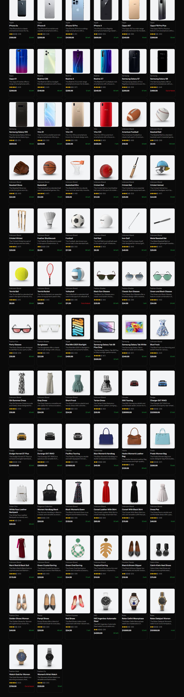
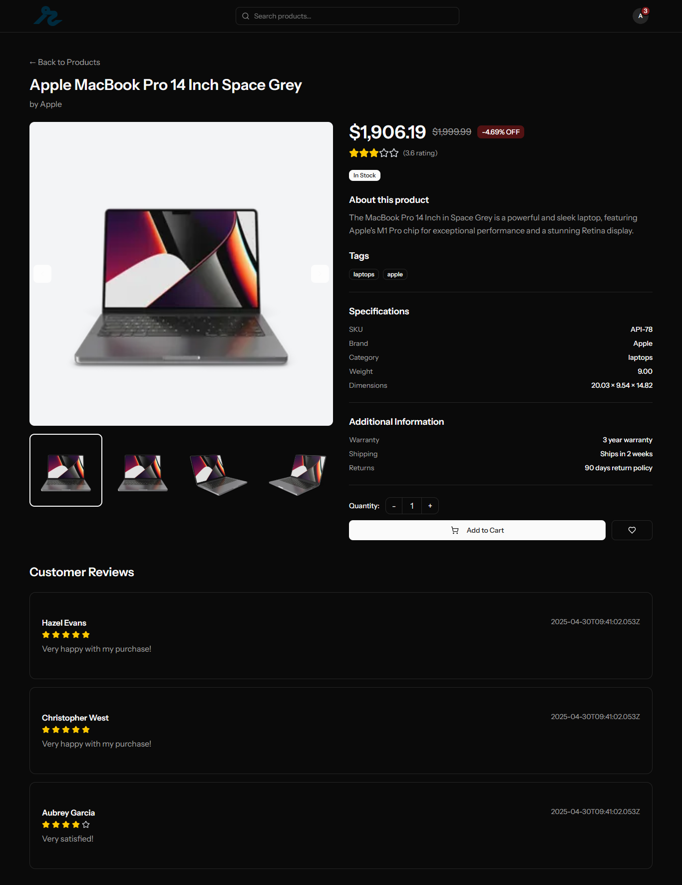

# Laravel E-Commerce Application

A modern e-commerce application built with Laravel 12, Filament for admin panel, React, Inertia.js, and TypeScript.

## UI Screenshots

### Home Page


### Product Details


## Features

- **Laravel 12** - Latest Laravel framework
- **React with TypeScript** - Modern frontend with type safety
- **Inertia.js** - SPA experience without API complexity
- **Laravel Fortify** - Authentication system with two-factor authentication
- **Laravel Wayfinder** - Advanced routing
- **Pest PHP** - Modern testing framework
- **SQLite Database** - Lightweight database for development

## Requirements

- PHP >= 8.2
- Composer
- Node.js >= 18.x
- NPM or Yarn

## Installation

Follow these steps to set up the project on your local machine:

### 1. Clone the Repository

```bash
git clone https://github.com/Afzal20/lara-ecom.git
cd lara-ecom
```

### 2. Install PHP Dependencies

Install all backend dependencies using Composer:

```bash
composer install
```

This will install:
- Laravel Framework
- Inertia.js Laravel adapter
- Laravel Fortify (Authentication)
- Laravel Wayfinder (Routing)
- Development tools (Pest, Pint, Sail)

### 3. Install JavaScript Dependencies

Install all frontend dependencies using NPM:

```bash
npm install
```

This will install React, TypeScript, Vite, and other frontend dependencies.

### 4. Environment Configuration

Copy the example environment file and generate an application key:

```bash
# Copy .env.example to .env
copy .env.example .env

# Generate application key
php artisan key:generate
```

### 5. Database Setup

The project uses SQLite by default. Create the database file and run migrations:

```bash
# The database file should already exist, but if not:
# type nul > database\database.sqlite

# Run migrations
php artisan migrate

# (Optional) Seed the database with sample data
php artisan db:seed
```

### 6. Storage Link

Create a symbolic link from `public/storage` to `storage/app/public`:

```bash
php artisan storage:link
```

### 7. Build Assets

Compile frontend assets for development:

```bash
npm run dev
```

Or build for production:

```bash
npm run build
```

### 8. Start Development Server

Start the Laravel development server:

```bash
php artisan serve
```

The application will be available at: `http://localhost:8000`

## Testing

Run the test suite using Pest:

```bash
# Run all tests
php artisan test

# Run tests with coverage
php artisan test --coverage

# Run specific test file
php artisan test tests/Feature/DashboardTest.php
```

## Code Quality

### Format Code with Laravel Pint

```bash
# Check code style
./vendor/bin/pint --test

# Fix code style
./vendor/bin/pint
```

### ESLint for TypeScript/React

```bash
npm run lint
```

## Available Commands

### Artisan Commands

```bash
# Clear all caches
php artisan optimize:clear

# Cache configuration
php artisan config:cache

# Cache routes
php artisan route:cache

# Cache views
php artisan view:cache

# List all routes
php artisan route:list

# Create a new controller
php artisan make:controller ControllerName

# Create a new model with migration
php artisan make:model ModelName -m

# Create a new migration
php artisan make:migration create_table_name

# Rollback last migration
php artisan migrate:rollback

# Fresh migration (drop all tables and re-migrate)
php artisan migrate:fresh

# Fresh migration with seeding
php artisan migrate:fresh --seed
```

### NPM Commands

```bash
# Start development server with hot reload
npm run dev

# Build for production
npm run build

# Type check TypeScript files
npm run type-check

# Lint JavaScript/TypeScript files
npm run lint
```

## Authentication

This project uses Laravel Fortify for authentication with the following features:

- User Registration
- Login / Logout
- Password Reset
- Email Verification
- Two-Factor Authentication
- Profile Management

##  Project Structure

```
laravel-ecommerce/
├── app/                    # Application core files
│   ├── Http/              # Controllers, Middleware, Requests
│   ├── Models/            # Eloquent models
│   └── Providers/         # Service providers
├── config/                # Configuration files
├── database/              # Migrations, seeders, factories
├── public/                # Public assets
├── resources/             # Views, frontend assets
│   ├── css/              # Stylesheets
│   ├── js/               # React/TypeScript components
│   └── views/            # Blade templates
├── routes/                # Route definitions
├── storage/               # Generated files, logs
├── tests/                 # Pest test files
└── vendor/                # Composer dependencies
```

## Frontend Stack

- **React 18** - UI library
- **TypeScript** - Type safety
- **Inertia.js** - Server-side routing with SPA experience
- **Vite** - Fast build tool
- **Tailwind CSS** - Utility-first CSS framework
- **ShadcN UI** - Component library

## Configuration

### Database

The project uses SQLite by default. To switch to MySQL or PostgreSQL:

1. Update `.env` file:

```env
DB_CONNECTION=mysql
DB_HOST=127.0.0.1
DB_PORT=3306
DB_DATABASE=your_database_name
DB_USERNAME=your_username
DB_PASSWORD=your_password
```

2. Run migrations:

```bash
php artisan migrate:fresh
```

### Mail Configuration

Update mail settings in `.env`:

```env
MAIL_MAILER=smtp
MAIL_HOST=smtp.mailtrap.io
MAIL_PORT=2525
MAIL_USERNAME=your_username
MAIL_PASSWORD=your_password
MAIL_ENCRYPTION=tls
MAIL_FROM_ADDRESS="noreply@example.com"
MAIL_FROM_NAME="${APP_NAME}"
```

## Deployment

### Production Build

```bash
# Install dependencies
composer install --optimize-autoloader --no-dev

# Install NPM dependencies
npm ci

# Build frontend assets
npm run build

# Cache configuration
php artisan config:cache
php artisan route:cache
php artisan view:cache

# Run migrations
php artisan migrate --force

# Set proper permissions
chmod -R 775 storage bootstrap/cache
```

### Environment Variables

Make sure to set these in production:

```env
APP_ENV=production
APP_DEBUG=false
APP_URL=https://yourdomain.com
```

## Troubleshooting

### Clear All Caches

```bash
php artisan optimize:clear
php artisan config:clear
php artisan cache:clear
php artisan route:clear
php artisan view:clear
```

### Regenerate Composer Autoload

```bash
composer dump-autoload
```

### Fix Storage Permissions

```bash
chmod -R 775 storage
chmod -R 775 bootstrap/cache
```

### Rebuild Frontend

```bash
rm -rf node_modules package-lock.json
npm install
npm run build
```

## License

This project is open-sourced software licensed under the [MIT license](https://opensource.org/licenses/MIT).

## Author

**Afzal20**

- GitHub: [@Afzal20](https://github.com/Afzal20)

## Contributing

Contributions, issues, and feature requests are welcome!

1. Fork the project
2. Create your feature branch (`git checkout -b feature/AmazingFeature`)
3. Commit your changes (`git commit -m 'Add some AmazingFeature'`)
4. Push to the branch (`git push origin feature/AmazingFeature`)
5. Open a Pull Request
